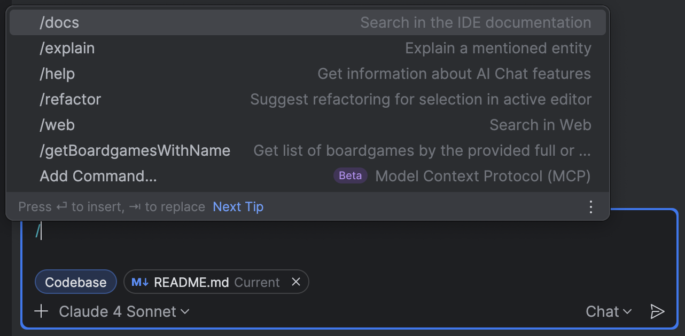

# MCP server for searching for boardgames

## Introduction

This is a small experiment to create an MCP server that can search for  
boardgames from BGG (BoardGameGeek). Written in Java, using Spring Boot and
[Spring AI](https://docs.spring.io/spring-ai/reference/api/mcp/mcp-server-boot-starter-docs.html).

## Usage

### Claude Desktop

Open the `claude_desktop_config.json` in your `/Users/<YOUR_USERNAME>/Library/Application Support/Claude`
and add the following:

```json
{
  "mcpServers": {
    "boardgame-mcp": {
      "command": "java",
      "args": [
        "-jar",
        "/absolute/path/to/the/jar/boardgame-stdio-0.1.0-SNAPSHOT.jar"
      ]
    }
  }
}
```

Restart Claude Desktop and the tool should be available.

### IntelliJ IDEA - AI Chat



In IntelliJ IDEAS AI Chat you type `/` and select the `Add Command...`
option. Then you can import the settings from Calude Desktop or follow
the detailed instructions from the 
[AI Assistant documentation page](https://www.jetbrains.com/help/ai-assistant/configure-an-mcp-server.html).
If succesful, you should see the `getBoardGamesWithName` command in the
list of commands.

## Acknowledgements

 * The code uses this [BGG Client](https://github.com/Bram--/bggclient).
 * Other tools and clients are listed in the [Geek Tools guild](https://boardgamegeek.com/guild/1229)
 * BGG (BoardGameGeek) provides the data through their [API](https://boardgamegeek.com/using_the_xml_api)


## Claude Desktop Troubleshooting

If you are using SDKMan on MacOS, the Java runtime might not be setup in a
way that Claude Desktop can use. If you see this error in the Claude Desktop
logs for your MCP server:

```terminaloutput
The operation couldn’t be completed. Unable to locate a Java Runtime.
```

Then you need to follow the instructions on this page: https://cuizhanming.com/claude-java-mcp-server/